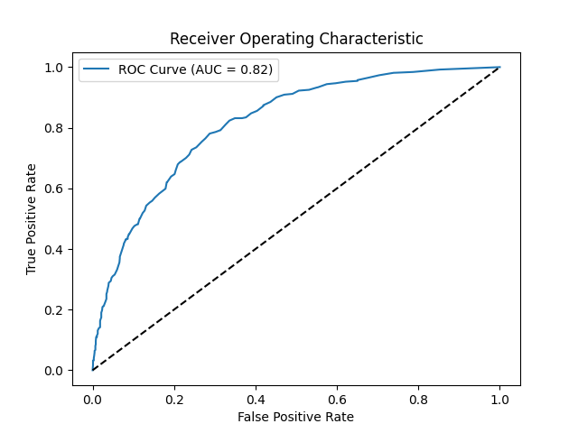
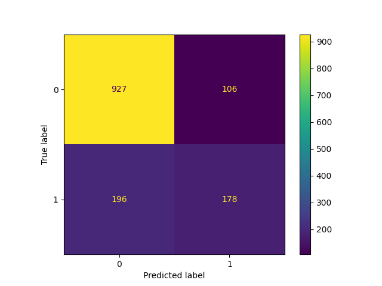

# 🚀 Churn Prediction MLOps Pipeline

Customer churn refers to when a customer stops using a company’s services — in telecom, this often means cancelling a subscription.  
This project predicts whether a customer is likely to churn based on usage behavior and demographic features.

It implements a full MLOps pipeline using DVC and MLflow — from data ingestion to model training, evaluation, and real-time prediction through a FastAPI endpoint, all containerized using Docker.

---

## 🧠 Overview

- 🌟 **Goal**: Predict whether a customer will churn based on service usage & demographics
- 📊 **Dataset**: [Telco Customer Churn](https://www.kaggle.com/datasets/blastchar/telco-customer-churn)
- 📁 **Pipeline Tools**: DVC for reproducibility, MLflow for experiment tracking
- 🔌 **API**: FastAPI with `/predict` endpoint for real-time inference
- 🐳 **Deployment**: Dockerized for easy hosting

---

## 📦 Tech Stack

| Layer         | Tools                                   |
|---------------|------------------------------------------|
| Language      | Python 3.10                              |
| ML            | Scikit-learn (RandomForest)              |
| MLOps         | DVC, MLflow                              |
| API           | FastAPI                                  |
| Container     | Docker                                   |
| Visualization | Matplotlib, Seaborn                      |

---

## 📁 Project Structure

```
.
├── api/                    # FastAPI app
│   ├── main.py
│   └── utils.py
├── src/                    # Scripts
│   ├── data_loader.py
│   ├── train.py
│   └── evaluate.py
├── data/                   # Cleaned dataset (via DVC)
├── model/                  # Trained model (MLflow output)
├── metrics.txt             # Accuracy and F1 score
├── roc_curve.png
├── confusion_matrix.png
├── dvc.yaml
├── Dockerfile
└── README.md
```

---

## 🔄 Pipeline Stages

| Stage     | Tool     | Output                                  |
|-----------|----------|------------------------------------------|
| `prepare` | DVC      | `data/cleaned.csv`                       |
| `train`   | MLflow   | `model/`, `classification_report.txt`    |
| `evaluate`| DVC      | `metrics.txt`, ROC & Confusion plots     |
| `predict` | FastAPI  | Real-time churn prediction               |

---

## 🥺 Try the API

Start the API server and go to:

```
http://localhost:8000/docs
```

Send this JSON payload to `/predict`:

```json
{
  "gender": "Female",
  "SeniorCitizen": 0,
  "Partner": "Yes",
  "Dependents": "No",
  "tenure": 5,
  "PhoneService": "Yes",
  "MultipleLines": "No",
  "InternetService": "Fiber optic",
  "OnlineSecurity": "No",
  "OnlineBackup": "No",
  "DeviceProtection": "No",
  "TechSupport": "No",
  "StreamingTV": "Yes",
  "StreamingMovies": "No",
  "Contract": "Month-to-month",
  "PaperlessBilling": "Yes",
  "PaymentMethod": "Electronic check",
  "MonthlyCharges": 75.35,
  "TotalCharges": 370.50
}
```

---

## 🐳 Run with Docker

### 🛠️ Build the Docker image

```bash
docker build -t churn-api .
```

### ▶️ Run the container

```bash
docker run -p 8000:8000 churn-api
```

If model directory isn't inside the image, mount it:

#### Windows (PowerShell):
```bash
docker run -p 8000:8000 -v ${PWD}/model:/app/model churn-api
```

#### macOS/Linux:
```bash
docker run -p 8000:8000 -v "$(pwd)/model:/app/model" churn-api
```

Then visit:
```
http://localhost:8000/docs
```

---

## 📊 Sample Outputs

### `metrics.txt`
```
Accuracy: 0.82
F1 Score: 0.68
```

### ROC Curve



### Confusion Matrix



---

## 🧠 What I Learned

- Designed reproducible pipelines using DVC
- Tracked and versioned models using MLflow
- Built and deployed a FastAPI app for real-time inference
- Containerized the entire workflow with Docker

---

## 🚀 Future Improvements

- Add CI/CD with GitHub Actions
- Deploy to Render, Railway, or EC2
- Log predictions to a database (PostgreSQL / MongoDB)
- Add unit testing with `pytest`
- Integrate Weights & Biases for remote experiment tracking

---

## 🤝 Connect with Me

Made with ❤️ by **Hardik Gandhi**  
🔗 [LinkedIn](https://www.linkedin.com/in/hardik-gandhi/)  
📧 hmgandhi03@gmail.com 
